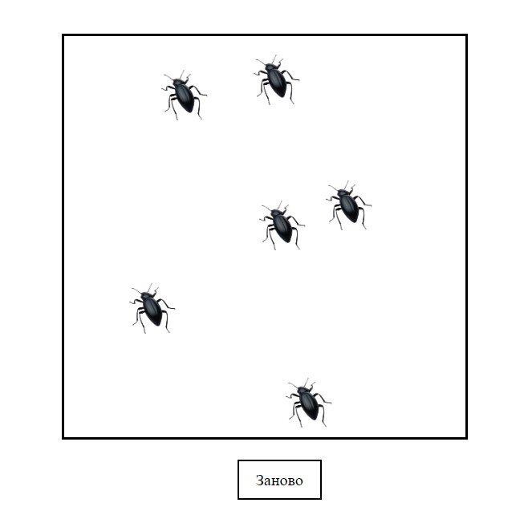

# Bug Hunter
Bug Hunter - игра по поимке жуков
## Правила
- Жуки перемещаются по полю, меняя свое положение каждые 600 мс
- Жук считается пойманным, если по нему произошел клик мыши (click), при этом жук **не будет пойман** одним только нажатием мыши (mousedown)
- Если игрок поймал всех жуков, выводится поздравительное сообщение
 ## Игра выглядит следующим образом

